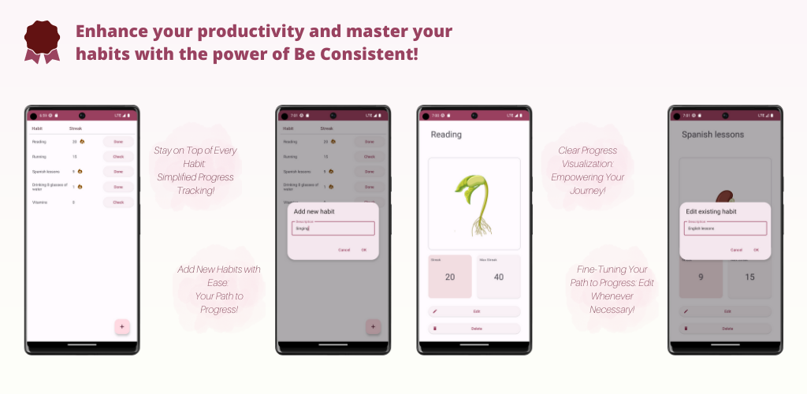

# Be consistent

A mobile app that allows you to track your habits and monitor your progress and also provides easy
access to review your progress and make easy changes or adjustments.

## Technologies

- Kotlin
- Android
- XML
- Room
- Coroutines
- Hilt
- Navigation component
- LiveData
- JUnit5
- MockK

## Logo

<a href="https://www.freepik.com/icon/habits_6213416">Icon by Flat Icons</a>

## Images

<a href="https://www.freepik.com/free-vector/diagram-showing-plant-growing-white-background_19376358.htm#page=2&query=growing%20plant&position=12&from_view=search&track=ais">
Image by brgfx</a> on Freepik

<a href="https://pl.freepik.com/darmowe-wektory/projekt-naklejki-z-uschla-roslina-w-doniczce-na-bialym-tle_21849696.htm#query=withered%20plant&position=1&from_view=search&track=ais">
Image by brgfx</a> na Freepik